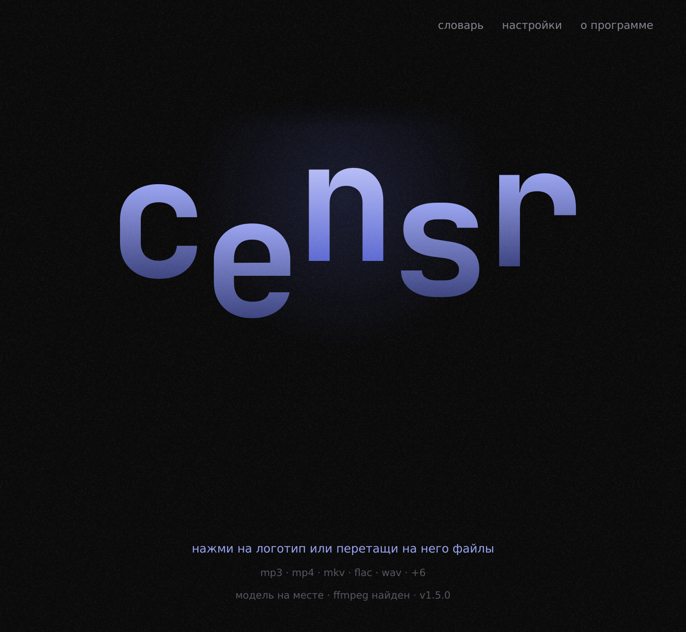
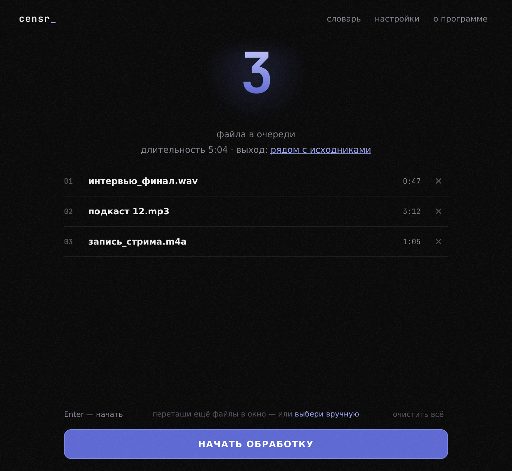
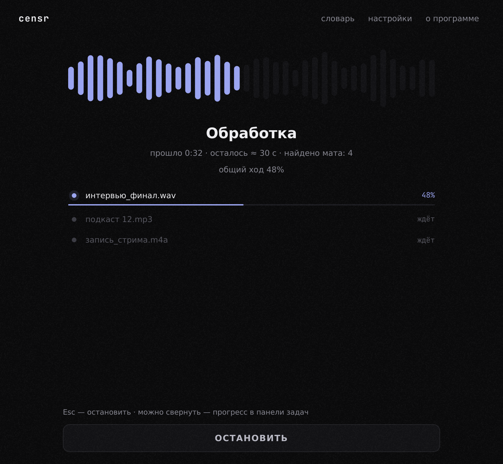
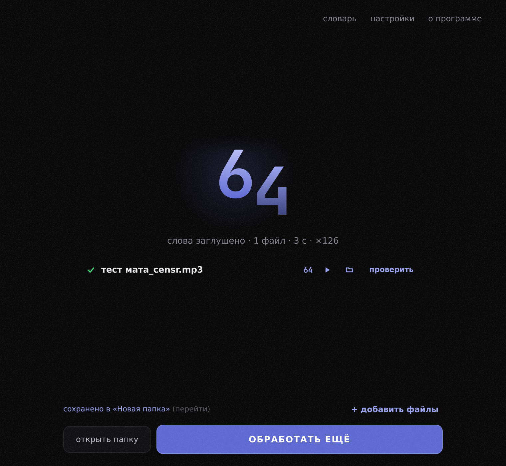
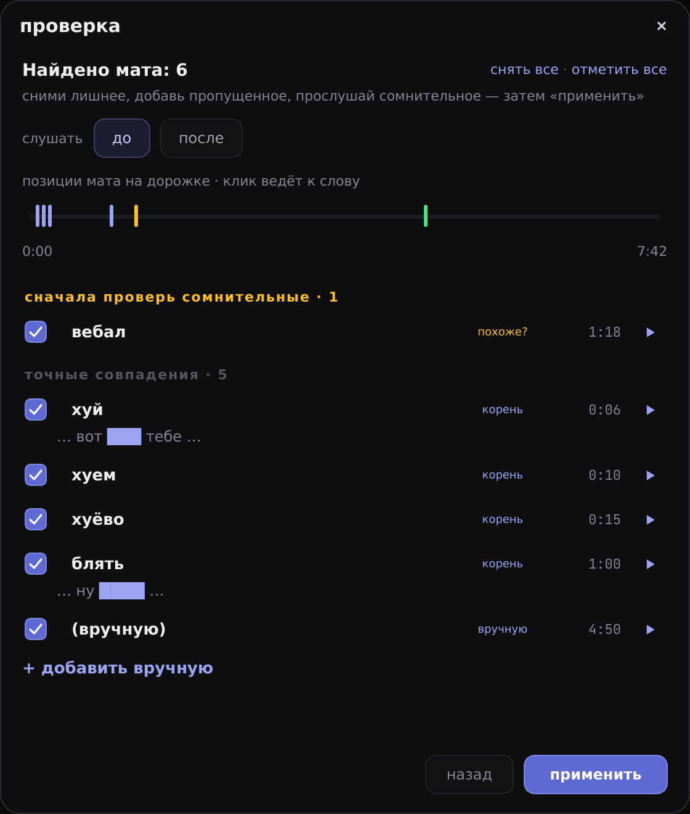
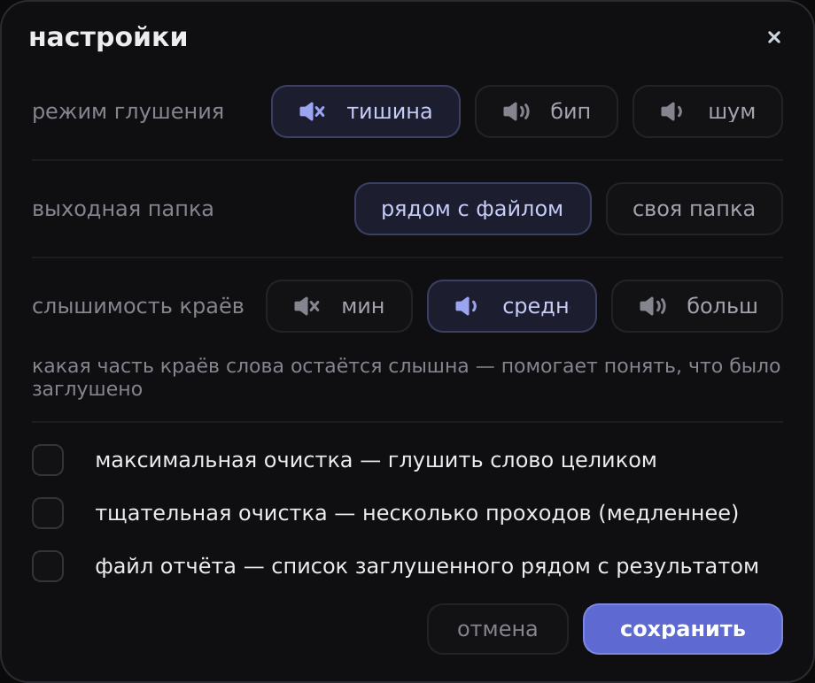
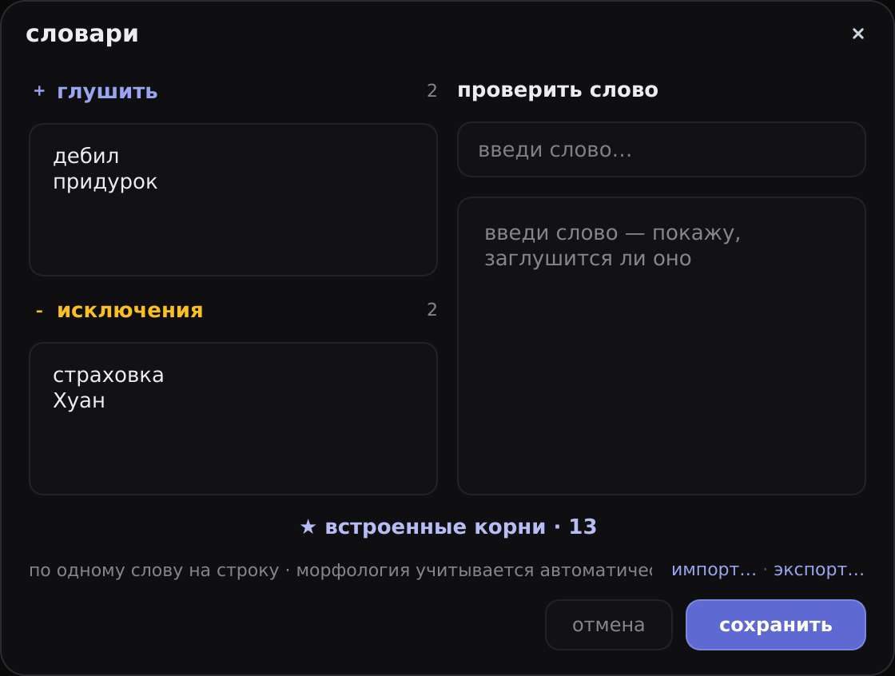

<div align="center">

<h1>🎬 censr</h1>

<p><b>Убираю мат из аудио и видео — локально, без интернета.</b></p>

<p>


</p>

<p>
<a href="../../releases"><b>⬇ Скачать установщик</b></a> &nbsp;·&nbsp;
<a href="#-что-нового-в-150">Что нового</a> &nbsp;·&nbsp;
<a href="BUILD.md">Сборка</a>
</p>



</div>

---

Распознаёт речь (**GigaAM-v3**, ONNX) с пословными таймкодами → находит мат по корням,
морфологии и нечётким совпадениям → глушит **только середину слова**, оставляя слышимые
края (`«б…ть»`) → сохраняет исходный формат, битрейт, теги, обложку, субтитры и вложения.

Всё считается на твоём компьютере: ни один файл никуда не загружается.

## ✨ Что нового в 1.5.0

- **🎯 Точнее границы.** Зона глушения ищется по энергии звука в обе стороны от слова —
  не «съедает» соседние слоги и не оставляет хвост мата.
- **🎧 «До» и «после».** В окне «проверка» слышно, как ляжет цензура (тишина/бип/шум),
  ещё до применения.
- **🧭 Таймлайн найденного** — позиции мата на дорожке, клик ведёт к слову.
- **🔎 Тестер слова** в словаре: вводишь слово — видишь, поймает ли его детектор и почему.
- **🎨 Полный редизайн** интерфейса; единый стиль очереди, обработки и «Готово».
- **💤 Не даёт ПК уснуть** во время обработки; прогресс — в панели задач (можно свернуть).
- **📦 Установщик и портатив** одним батником.

## 🖼 Как это выглядит

|  |  |
|:-:|:-:|
| **очередь** | **обработка** |
|  |  |
| **готово** | **проверка + таймлайн** |
|  |  |
| **настройки** | **словарь + тестер слова** |
|  |  |

## 🎬 Видео и дорожки

Видео (`mp4`/`mkv`/`webm`): глушится только аудиодорожка, видеопоток копируется без
перекодирования — быстро и без потери качества. Если аудиодорожек несколько, у файла
появляется раскрытие со списком и галочками: обрабатываются только выбранные, остальные
копируются как есть. В CLI — флаг `--track` (`all` или, например, `1,3`; нумерация с 1).

## 🔎 Проверка и ручная правка

У каждого готового файла есть кнопка «проверить» — открывает список всего заглушенного
с таймкодами, пометкой уверенности («корень» / «похоже?») и **таймлайном** позиций. Можно:

- снять галочку, если слово зацепило зря;
- прослушать фрагмент в режиме **«до»** (оригинал) или **«после»** (как ляжет цензура) —
  ещё до применения;
- добавить пропущенный момент вручную по таймкоду (мм:сс).

После правок файл пересобирается за секунды — **без повторного распознавания** (по готовым
зонам из отчёта, в фоне). Снимешь все слова — выход станет бит-в-бит копией оригинала.

## 📖 Словарь

Свой список запрещённых слов и белый список — **с учётом морфологии**: одна форма ловит все
словоформы. Встроенные корни открываются в отдельном окне. **Тестер слова**: введи слово и
сразу увидишь, как его классифицирует детектор (твой список / похоже на мат / встроенный
корень / в исключениях / чистое).

## ⬇ Установка (Windows)

Не нужен ни Python, ни ffmpeg — всё внутри. Скачай `Censr-Setup-1.5.0.exe` из раздела
[**Releases**](../../releases) и запусти. Права администратора не нужны (ставится в профиль
пользователя).

> **Антивирус.** Неподписанные `.exe` от PyInstaller иногда дают ложные срабатывания
> ML-эвристик (Wacatac и т. п.) — это не вирус. Подробности — в [`BUILD.md`](BUILD.md).

## 🛠 Запуск из исходников

```bat
pip install -r requirements.txt
python -m censr              :: GUI
python -m censr file.mp3     :: CLI
```

При первом запуске модель (~250 МБ) скачивается с Hugging Face автоматически. Офлайн:
положи `v3_ctc.int8.onnx` и `v3_vocab.txt` из
[istupakov/gigaam-v3-onnx](https://huggingface.co/istupakov/gigaam-v3-onnx) в
`models/gigaam-v3-onnx/`. Нужен ffmpeg в PATH.

## ⌨ CLI

```bat
python -m censr.cli "папка_или_файлы" -o выход [--beep] [--noise] [--suffix _clean] [--no-cache] [--track 1,3] [--full] [--thorough]
```

Режим глушения: тишина (по умолчанию), `--beep` (бип 1 кГц) или `--noise` (мягкий шум).
Рядом с каждым выходным файлом пишется `*.report.json` — список заглушенных слов с
таймкодами (нужен кнопке «проверить»). Кэш транскрипта: повторная обработка того же файла с
другими настройками идёт без распознавания (`--no-cache` отключает).

## ⚙ Настройка глушения

- **Режим:** тишина / бип / шум.
- **Слышимость краёв:** 5 / 12 / 20 % длительности слова остаётся слышно.
- **Максимальная очистка** (`--full`): глушить слово целиком, без краёв.
- **Тщательная очистка** (`--thorough`): несколько проходов распознавания — добивает
  слова, вскрывшиеся после глушения. Медленнее, но чище.

Тонкая геометрия зон — константы в `censr/audio_zone.py`
(`KEEP_HEAD_S`, `KEEP_TAIL_S`, `KEEP_FRAC`, `MUTE_MIN_S`, `FULL_MUTE_DUR_S`).

## 🧱 Сборка

Одна команда — `build.bat` (Windows + Python 3.10+; для установщика —
[Inno Setup 6](https://jrsoftware.org/isdl.php)). Делает портативную папку, zip и установщик.
Подробности и точечные флаги — в [`BUILD.md`](BUILD.md).

## 🗂 Структура

| файл | назначение |
|---|---|
| `censr/asr.py` | транскрипция (onnx-asr, чанки по тихим местам) |
| `censr/detector.py` | детектор мата (корни + pymorphy3 + Левенштейн) |
| `censr/audio.py` | декод/энкод, огибающая громкости, бип/шум |
| `censr/audio_zone.py` | геометрия зон (что именно глушить) |
| `censr/pipeline.py` | связка ASR → детектор → глушение → отчёт |
| `censr/native.py` | Windows: тёмный заголовок, прогресс в панели задач, анти-сон |
| `censr/gui.py`, `censr/cli.py` | интерфейсы |
| `tests/` | юнит-тесты |

## 📄 Лицензия

[MIT](LICENSE) — используй, меняй, распространяй свободно.

Зависимости — под своими лицензиями: ffmpeg вызывается как внешняя программа (LGPL/GPL),
PySide6 — LGPL, модель GigaAM-v3 — со своими условиями на
[Hugging Face](https://huggingface.co/istupakov/gigaam-v3-onnx). Они не вкомпилированы в код,
а вызываются/линкуются отдельно, поэтому на код Censr распространяется только MIT.
