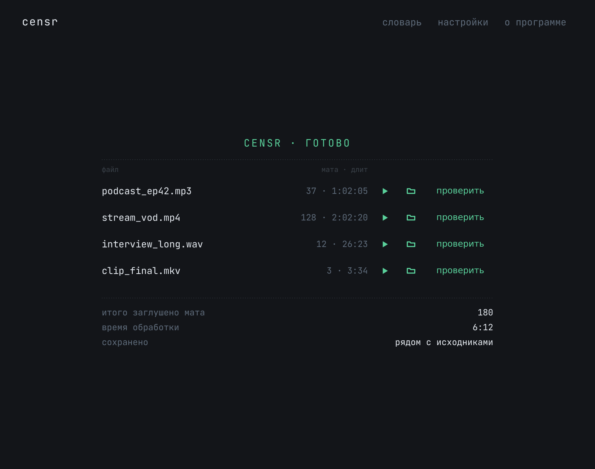
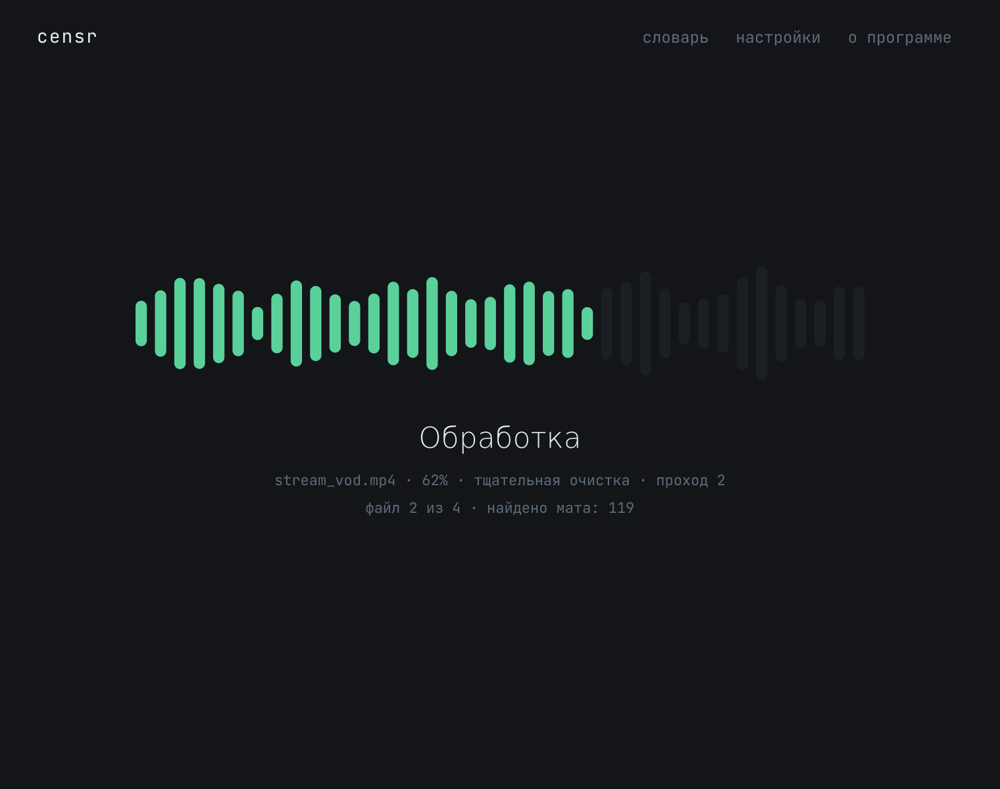
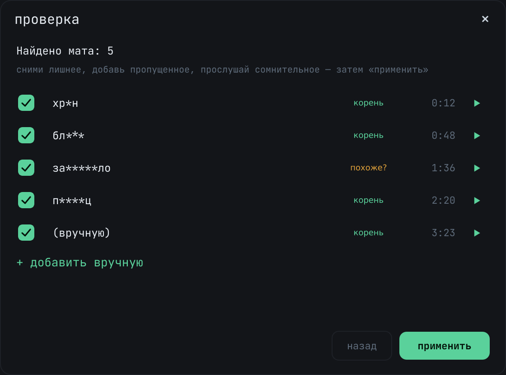
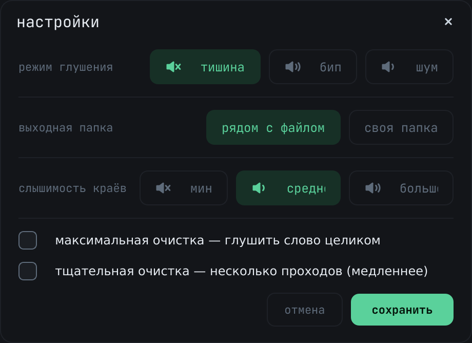

# Censr — удаление мата из аудио и видео

Локально, без интернета: GigaAM-v3 (ONNX) распознаёт речь с пословными
таймкодами → детектор мата (морфология + fuzzy) → глушение середины слова
с сохранением слышимых краёв («б…ть») → выход в исходном формате/битрейте,
с тегами, обложкой, субтитрами и вложениями исходника.

Видео (`mp4`/`mkv`/`webm`): глушится только аудиодорожка, видеопоток копируется
без перекодирования (быстро, без потери качества).

Несколько аудиодорожек: если их больше одной, в GUI у файла появляется раскрытие
со списком дорожек и галочками (по умолчанию отмечены все). Обрабатываются только
выбранные; невыбранные копируются в выход без изменений. В CLI — флаг
`--track` (`all` или, например, `1,3`; нумерация с 1).

Кэш транскрипта: распознавание делается один раз и кэшируется в
`%APPDATA%\Censr\cache\` (ключ — путь+размер+mtime+модель). Повторная обработка
того же файла с другими настройками (тишина↔бип, % краёв, словарь) идёт без ASR.
Отключить: CLI `--no-cache` или `use_cache: false` в `settings.json`.

## Что нового в 1.5.0

- **Точнее границы цензуры.** Зона глушения теперь ищется по энергии звука в обе
  стороны от слова — не «съедает» соседние слоги и не оставляет хвост мата.
- **«До» и «после» в проверке.** Прослушивание результата (тишина/бип/шум) прямо
  в списке — слышно, как ляжет цензура, ещё до применения.
- **Таймлайн найденного** в окне «проверка»: позиции мата на дорожке, клик по
  метке ведёт к слову.
- **Тестер слова** в словаре: вводишь слово — видишь, поймает ли его детектор и почему.
- **Полный редизайн** интерфейса; очередь, обработка и «Готово» — в едином стиле.
- **Не даёт ПК уснуть** во время обработки; прогресс дублируется в панели задач —
  окно можно свернуть.
- **Установщик и портативная сборка** одним батником (`build.bat`).

## Скриншоты

| Готово | Обработка |
|---|---|
|  |  |

| Проверка и ручная правка | Настройки |
|---|---|
|  |  |

## Проверка и ручная правка

У каждого готового файла есть кнопка «проверить». Она открывает список всего, что
заглушено, — с таймкодами, пометкой уверенности («корень» / «похоже?») и
**таймлайном** позиций на дорожке. Можно:

- снять галочку, если слово зацепило зря;
- прослушать фрагмент в режиме **«до»** (оригинал) или **«после»** (как реально
  ляжет цензура — тишина/бип/шум), ещё до применения;
- добавить пропущенный момент вручную по таймкоду (мм:сс).

После правок файл пересобирается за секунды — **без повторного распознавания**:
правки применяются по готовым зонам из отчёта (`pipeline.recensor()`), пересборка
идёт в фоне, окно не зависает, а отчёт обновляется (повторное «проверить» покажет
именно твои правки). Если снять все слова — выход станет бит-в-бит копией
оригинала, без лишнего перекодирования.

## Словарь

Свой список запрещённых слов и белый список — с учётом морфологии: одна форма
ловит все словоформы. Встроенные корни открываются в отдельном окне. **Тестер
слова**: введи слово и сразу увидишь, как его классифицирует детектор (твой список /
похоже на мат / встроенный корень / в исключениях / чистое). GUI — кнопка
«словарь»; файл — `%APPDATA%\Censr\settings.json` → `extra_words` / `whitelist`.

## Быстрый старт (из исходников)

```bat
pip install -r requirements.txt
python -m censr              :: GUI
python -m censr file.mp3     :: CLI
```

При первом запуске модель (~250 МБ) скачивается с Hugging Face автоматически.
Офлайн-вариант: положи `v3_ctc.int8.onnx` и `v3_vocab.txt` из
https://huggingface.co/istupakov/gigaam-v3-onnx в папку `models/gigaam-v3-onnx/`
и укажи её: CLI `--model-path models/gigaam-v3-onnx`, GUI — настройка `model_dir`
в `%APPDATA%\Censr\settings.json`.

Требуется ffmpeg в PATH (https://www.gyan.dev/ffmpeg/builds/ → ffmpeg-release-essentials).

## CLI

```bat
python -m censr.cli "папка_или_файлы" -o выходная_папка [--beep] [--noise] [--suffix _clean] [--no-cache] [--track 1,3] [--full] [--thorough]
```

Режим глушения: тишина (по умолчанию), `--beep` (бип 1 кГц) или `--noise`
(негромкий мягкий шум). В GUI — переключатель «тишина / бип / шум».

Рядом с каждым выходным файлом создаётся `*.report.json` — список заглушенных
слов с таймкодами (нужен кнопке «проверить»).

## Настройка глушения

`censr/audio_zone.py`, константы:
- `KEEP_HEAD_S` / `KEEP_TAIL_S` — максимум слышимого края (первая/последняя буква)
- `KEEP_FRAC` — доля длительности слова на край
- `MUTE_MIN_S` — минимальная заглушенная середина
- `FULL_MUTE_DUR_S` — слова короче глушатся целиком

Слышимость краёв в GUI: 5 / 12 / 20 %. Свой список слов/белый список:
`%APPDATA%\Censr\settings.json` → `extra_words` / `whitelist`.

Максимальная очистка: глушит слово целиком, без слышимых краёв. GUI — галочка
«максимальная очистка» в настройках; CLI — флаг `--full`; settings.json →
`full_mute: true`.

Тщательная очистка: несколько проходов распознавания за один запуск (до 3).
После глушения звук меняется, и повторное распознавание вскрывает слова,
пропущенные на первом проходе, и краевые артефакты — режим добивает их сам, пока
не станет чисто. Медленнее (распознавание ×число проходов). GUI — галочка
«тщательная очистка»; CLI — флаг `--thorough`; settings.json → `thorough_clean: true`.

## Структура

- `censr/asr.py` — транскрипция (onnx-asr, чанки по тихим местам)
- `censr/detector.py` — детектор мата (корни + pymorphy3 + Левенштейн)
- `censr/audio.py` — декод/энкод, огибающая громкости, бип/шум
- `censr/audio_zone.py` — геометрия зон (что именно глушить)
- `censr/pipeline.py` — связка + отчёт
- `censr/native.py` — интеграция с Windows (тёмный заголовок, прогресс в панели задач, анти-сон)
- `censr/gui.py`, `censr/cli.py` — интерфейсы
- `tests/` — юнит-тесты: детектор, геометрия зон, ASR-нарезка, огибающая/глушение, пайплайн

## Готовая сборка для Windows

Не нужен ни Python, ни ffmpeg — всё внутри. Скачай установщик `Censr-Setup-x.x.x.exe`
из раздела [Releases](../../releases) и запусти. Права администратора не требуются
(ставится в профиль пользователя).

Собрать самому: одна команда `build.bat` (нужны Windows + Python 3.10+; для
установщика — [Inno Setup 6](https://jrsoftware.org/isdl.php), без него выйдет
только портативная сборка). Подробности — в [`BUILD.md`](BUILD.md).

> **Антивирус.** Неподписанные `.exe` от PyInstaller иногда дают ложные
> срабатывания ML-эвристик (Wacatac и т. п.) — это не вирус. Подробности — в `BUILD.md`.

## Лицензия

[MIT](LICENSE). Используй, меняй, распространяй свободно.

Зависимости поставляются под своими лицензиями: ffmpeg вызывается как внешняя
программа (LGPL/GPL-сборки), PySide6 — LGPL, модель GigaAM-v3 — со своими условиями
на [Hugging Face](https://huggingface.co/istupakov/gigaam-v3-onnx). Поскольку они
не вкомпилированы в код, а вызываются/линкуются как отдельные компоненты, на код
Censr распространяется только MIT.
